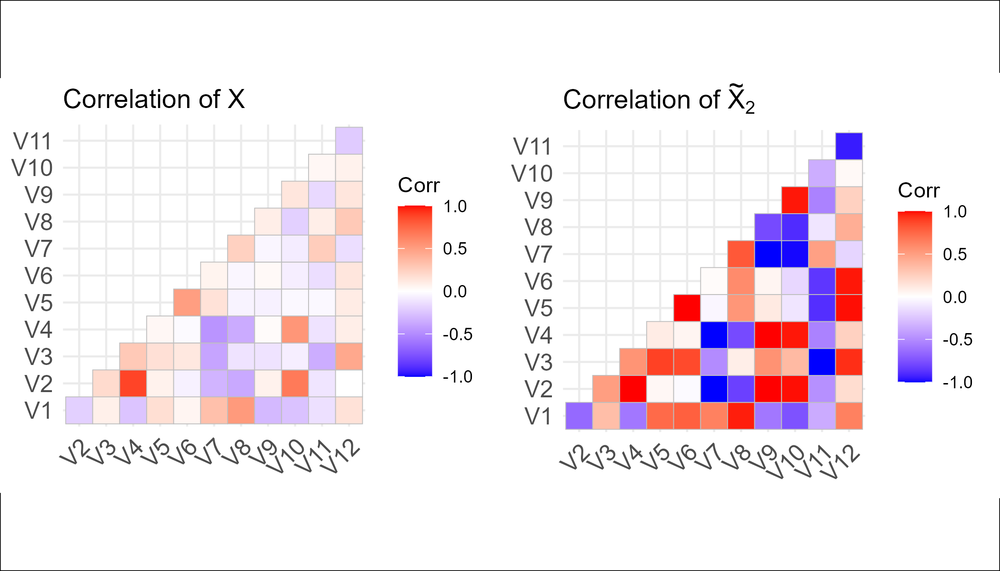
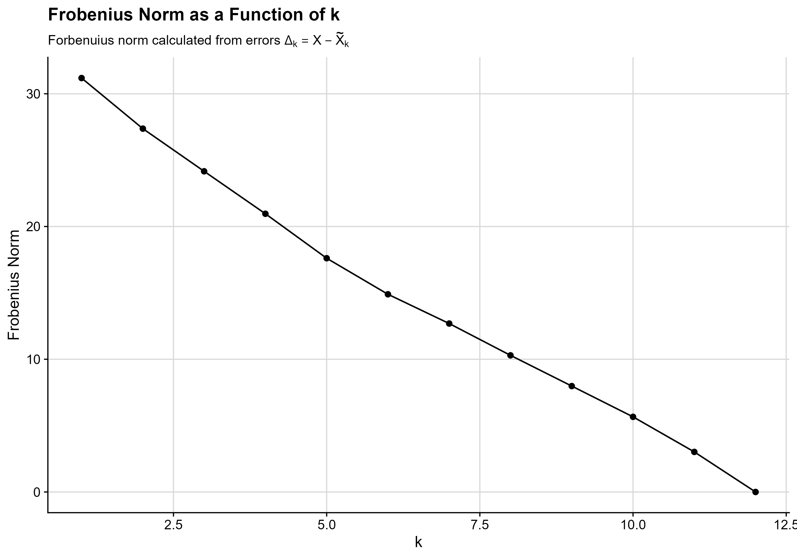
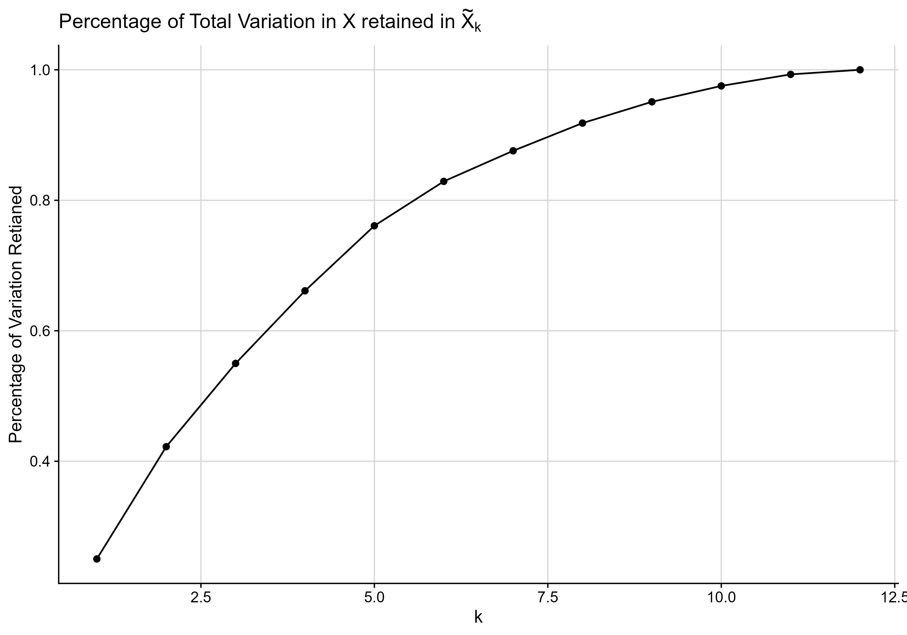

```{r}
#load required libraries
library(ggplot2)
library(cowplot)
library(knitr)
library(ggcorrplot)

#read in data
x <- read.csv("CA2.csv")

#find lower rank approximations of X 
x_svd <- svd(x)
u <- x_svd$u
d <- x_svd$d
v <- x_svd$v

#Function to find lower rank approximations of x
#k: rank 
#this wasn't working as u was a column vector 
rankk <- function(k){
  approx <- matrix(u[,1:k], ncol = k) %*% diag(d)[1:k, 1:k, drop = F] %*% t(v[,1:k])
  return(approx)
}

#Calculate error for each approximation 
x_mat <- as.matrix(x) #convert x to matrix 
errors <- list()
for (i in 1:12){
  errors[[i]] <- x_mat - rankk(i)
}

```

## Question 1

```{r}
#Extract rank 4 errors
errors_4 <- (errors[[4]])

#Average errors 
r4_mean_err <- colMeans(errors_4)
r4_mean_err <- as.data.frame(r4_mean_err)
colnames(r4_mean_err) <- "Error"

#Display output as table 
kable(r4_mean_err,
      caption = "Rank 4 Approximation Error")
```

## Question 2

As see in @fig-corplot *insert interpretation here* 

::: {#fig-corplot}


Correlation plots comparing X and the rank 2 approximation of X. 
:::

```{r}
#Correlation marix of x
cor_x <- cor(x)

#Correlation matrix of x-rank 2 \
#renaming rows 
cor_r2 <- cor(as.data.frame(rankk(2), row.names = c("V1", "V2", "V3", "V4", "V5", "V6", "V7", "V8", "V9", "V10", "V11", "V12")))
```

```{r corplot, fig.show = 'hold', fig.cap = 'Correlation plots comparing X and the rank 2 approximation of X'}

#Correlation plot for X
p1 <- ggcorrplot(cor_x, type = "lower", title = "Correlation of X")

#Correlation plot for rank = 2
p2 <- ggcorrplot(cor_r2, type = "lower", title = expression(paste("Correlation of ", tilde(X)[2])))

#Combine plots
combined_plot <- plot_grid(p1, p2, ncol = 2)
combined_plot <- combined_plot +
  theme(
    plot.background = element_rect(fill = "white"),
    panel.background = element_rect(fill = "white")
  )

# ggsave("_figure/corplot.png", plot = combined_plot, height = 4)
```

## Question 3

As see in @fig-Frobenius the Frobenius norm decreases approximately linearly as k increases. This is expected as higher rank approximates contain more information about the dataset, x, and thus have a smaller error.

::: {#fig-Frobenius}


Frobenius Norm against k.
:::

```{r}
#Calculate Frobenius norm for all errors 
f_norm <- numeric(12)
for (i in 1:12){
  f_norm[i] <- norm(errors[[i]], type = "F")
}

#Plot Frobenius norm as a function of k
k <- seq(1:12)

plott <- ggplot(data = NULL,
       mapping = aes(x = k, y = f_norm)) +
  geom_point() +
  geom_line() +
  labs(
    title = "Frobenius Norm as a Function of k",
    subtitle = expression(paste("Frobenuius norm calculated from errors ", Delta[k] == X - tilde(X)[k])),
    x = "k",
    y = "Frobenius Norm"
  ) +
  theme_cowplot(font_size = 14) +
  background_grid(major = "xy")

plott <- plott +
  theme(plot.background = element_rect(fill = "white"),
        panel.background = element_rect(fill = "white")
        )

# dir.create("_figure", showWarnings = FALSE)
# ggsave("_figure/Frobenius-norm-plot.png", plot = plott, width = 10)
```

## Question 4

As seen in @fig-Percvar the percentage of variation retained increases as k increases. This is expected as higher rank approximates contain more informartion about the original dataset and thus explain more variation in the data.

::: {#fig-Percvar}


Percentage Variation Retained in X.
:::

```{r}
#Total variation in x
tot_var <- sum(d^2)

#Percentage variation 
rank_var <- numeric(12)
for (i in 1:12){
  rank_var[i] <- sum((diag(d)[1:i, 1:i, drop = F])^2)
  perc_var <- rank_var/tot_var
}

#Plot percentage 
plott2 <- ggplot(data = NULL,
       mapping = aes(x = k, y = perc_var)) +
  geom_point() +
  geom_line() +
  labs(
    title = expression(paste("Percentage of Total Variation in ", X, " retained in ", tilde(X)[k])), 
    x = "k",
    y = "Percentage of Variation Retianed"
  ) +
  theme_cowplot(font_size = 14) +
  background_grid(major = "xy")

plott2 <- plott2 +
  theme(plot.background = element_rect(fill = "white"),
        panel.background = element_rect(fill = "white")
        )

# ggsave("_figure/Perc-var-plot.png", plot = plott2, width = 10)
```
