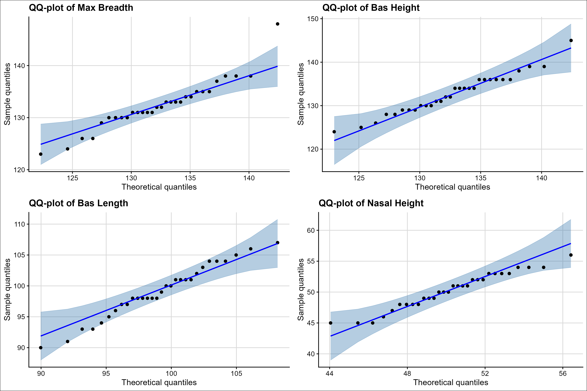
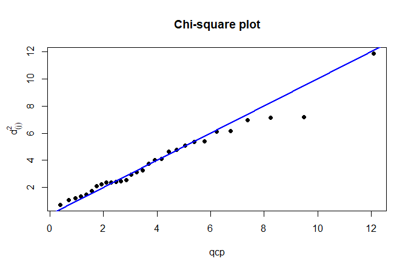

## Question 1

Suppose $X \sim N_p(\mu, \Sigma)$. Show that the maximum likelihood estimator of $\Sigma$ is biased, and give the bias.

### Solution

Let $X_1, X_2, \ldots, X_n$ be a random sample from a $p$-dimensional multivariate normal distribution $N_p(\mu, \Sigma)$.

The likelihood function for the sample is:

$$
L(\mu, \Sigma) = \prod_{i=1}^n \frac{1}{(2\pi)^{p/2}|\Sigma|^{1/2}} \exp\left\{-\frac{1}{2}(X_i - \mu)'\Sigma^{-1}(X_i - \mu)\right\}
$$

$$
L(\mu, \Sigma) = (2\pi)^{-np/2}|\Sigma|^{-n/2}\exp\left\{-\frac{1}{2}\sum_{i=1}^n (X_i - \mu)'\Sigma^{-1}(X_i - \mu)\right\}
$$

The maximum likelihood estimators obtained by maximizing the log-likelihood function:

$$
\ell(\mu, \Sigma) = -\frac{np}{2}\ln(2\pi) - \frac{n}{2}\ln|\Sigma| - \frac{1}{2}\sum_{i=1}^n (X_i - \mu)'\Sigma^{-1}(X_i - \mu)
$$

Taking derivatives and setting to zero yields:

$$
\hat{\mu} = \bar{X} = \frac{1}{n}\sum_{i=1}^n X_i
$$

$$
\hat{\Sigma} = \frac{1}{n}\sum_{i=1}^n (X_i - \bar{X})(X_i - \bar{X})'
$$

To find the expected value of $\hat{\Sigma}$, we use the following decomposition:

$$
\sum_{i=1}^n (X_i - \bar{X})(X_i - \bar{X})' = \sum_{i=1}^n (X_i - \mu)(X_i - \mu)' - n(\bar{X} - \mu)(\bar{X} - \mu)'
$$

Taking expectations:

$$
E\left[\sum_{i=1}^n (X_i - \bar{X})(X_i - \bar{X})'\right] = \sum_{i=1}^n E[(X_i - \mu)(X_i - \mu)'] - nE[(\bar{X} - \mu)(\bar{X} - \mu)']
$$

Now, we know that: - For each $i$, $E[(X_i - \mu)(X_i - \mu)'] = \Sigma$ since $\text{Var}(X_i) = \Sigma$ - For the sample mean, $\text{Var}(\bar{X}) = \frac{\Sigma}{n}$, therefore: $$
  E[(\bar{X} - \mu)(\bar{X} - \mu)'] = \frac{\Sigma}{n}
  $$

Substituting these results:

$$
E\left[\sum_{i=1}^n (X_i - \bar{X})(X_i - \bar{X})'\right] = \sum_{i=1}^n \Sigma - n\left(\frac{\Sigma}{n}\right)
$$

$$
E\left[\sum_{i=1}^n (X_i - \bar{X})(X_i - \bar{X})'\right] = n\Sigma - \Sigma = (n-1)\Sigma
$$

Now, the expectation of $\hat{\Sigma}$ is:

$$
\begin{aligned}
E[\hat{\Sigma}] &= E\left[\frac{1}{n}\sum_{i=1}^n (X_i - \bar{X})(X_i - \bar{X})'\right] \\
&= \frac{1}{n}E\left[\sum_{i=1}^n (X_i - \bar{X})(X_i - \bar{X})'\right] \\
&= \frac{1}{n} \cdot (n-1)\Sigma = \frac{n-1}{n}\Sigma
\end{aligned}
$$

Therefore, the bias is:

$$
\begin{aligned}
\text{Bias}(\hat{\Sigma}) 
&= E[\hat{\Sigma}] - \Sigma \\ 
&= \frac{n-1}{n}\Sigma - \Sigma \\
&= -\frac{1}{n}\Sigma
\end{aligned}
$$

The maximum likelihood estimator $\hat{\Sigma}$ is biased downward, with bias $-\frac{1}{n}\Sigma$. This means the MLE systematically underestimates the true covariance matrix. The unbiased estimator is given by:

$$
S = \frac{n}{n-1}\hat{\Sigma} = \frac{1}{n-1}\sum_{i=1}^n (X_i - \bar{X})(X_i - \bar{X})'
$$

which satisfies $E[S] = \Sigma$.

\newpage

## Question 2

### Marginal normality

```{r}
library(readr)
library(tidyverse)
library(ggplot2)
library(cowplot)
library(knitr)
library(ggcorrplot)
library(qqplotr)
CA4 <- read_csv("CA1.csv")
#Filter for Time Period = 2
P2 <- CA4 |>
  filter(TimePeriod == 2) |>
  select(MaxBreadth, BasHeight, BasLength, NasHeight)

#Factors 
MaxB <- P2$MaxBreadth
BasH <- P2$BasHeight
BasL <- P2$BasLength
NasH <- P2$NasHeight

#QQ-plot using ggplot2
#MaxB
p1 <- ggplot(mapping = aes(sample = MaxB)) +
  stat_qq_band(col = "steelblue", fill = "steelblue", alpha = 0.4) +
  stat_qq_point() +
  labs(
    title = "QQ-plot of Max Breadth",
    x = "Theoretical quantiles",
    y = "Sample quantiles"
  ) +
  stat_qq_line(col = "blue") +
  theme_cowplot(font_size = 12) +
  background_grid(major = "xy")

#BasH
p2 <- ggplot(mapping = aes(sample = BasH)) +
  stat_qq_band(col = "steelblue", fill = "steelblue", alpha = 0.4) +
  stat_qq_point() +
  labs(
    title = "QQ-plot of Bas Height",
    x = "Theoretical quantiles",
    y = "Sample quantiles"
  ) +
  stat_qq_line(col = "blue") +
  theme_cowplot(font_size = 12) +
  background_grid(major = "xy")

#BasL
p3 <- ggplot(mapping = aes(sample = BasL)) +
  stat_qq_band(col = "steelblue", fill = "steelblue", alpha = 0.4) +
  stat_qq_point() +
  labs(
    title = "QQ-plot of Bas Length",
    x = "Theoretical quantiles",
    y = "Sample quantiles"
  ) +
  stat_qq_line(col = "blue") +
  theme_cowplot(font_size = 12) +
  background_grid(major = "xy")

#NasH
p4 <- ggplot(mapping = aes(sample = NasH)) +
  stat_qq_band(col = "steelblue", fill = "steelblue", alpha = 0.4) +
  stat_qq_point() +
  labs(
    title = "QQ-plot of Nasal Height",
    x = "Theoretical quantiles",
    y = "Sample quantiles"
  ) +
  stat_qq_line(col = "blue") +
  theme_cowplot(font_size = 12) +
  background_grid(major = "xy")

#Combine plots
combined_plot <- plot_grid(p1, p2, p3, p4, ncol = 2)
combined_plot <- combined_plot +
  theme(
    plot.background = element_rect(fill = "white"),
    panel.background = element_rect(fill = "white")
  )

# ggsave("_figure/qqplot.png", plot = combined_plot, height = 8, width = 12)
```

In @fig-qqplot, all variables appear to be marginally normally distributed, except for a possible outlier in the max breadth plot. After conducting a test for normality, the large p-values in @tbl-SWtable indicate that bas height, bas length and nasal height do not deviate significantly from normality. Max breadth has a p-value of 0.04, which is much lower than the other explanatory variables. A p-value of 0.04 provides some evidence against normality. However, the Shapiro-Wilk test is sensitive to outliers and the outlier seen in @fig-qqplot may be causing this low p-value. Visually, max breadth appears to be normally distributed.

::: {#fig-qqplot}


QQ-plots to assess marginal normality for maximal breadth of skull, basibregmatic height of skull, basialveolar length of skull and nasal height of skull.
:::

```{r}
#Shapiro-Wilks test 
SW1 <- shapiro.test(MaxB)
SW2 <- shapiro.test(BasH)
SW3 <- shapiro.test(BasL)
SW4 <- shapiro.test(NasH)

#Extract p-values
SW1 <- SW1$p.value
SW2 <- SW2$p.value
SW3 <- SW3$p.value
SW4 <- SW4$p.value

#Create table 
pval <- round(rbind(SW1, SW2, SW3, SW4), 4)
nam <- rbind(c("Maximal breadth of skull"), c("Basibregmatic height of skull"), c("Basialveolar length of skull"), c("Nasal height of skull"))
dat <- cbind(nam, pval)
dat <- as.data.frame(dat)
row.names(dat) <- NULL
colnames(dat) <- c("", "p-value")
```

\newpage

```{r}
#| label: tbl-SWtable
#| tbl-cap: "Shapiro-Wilk test for normality."
kable(dat)

```

### Multivariate normality

```{r}
#| fig-show: hide

#Multivariate normality 
#S: covariance matrix
S <- cov(P2)

#n: number of observations
n <- nrow(P2)

#Calculate the square distances 
d2 <- mahalanobis(P2, colMeans(P2), cov = S)

#Order the squared distances
d2_ord <- sort(d2)

#Determine 50% critical value
crit_val <- qchisq(0.5, df = 2)
crit_val <- round(crit_val, 4)

#determine how many d2 values are less than critical value 
prop <- mean(d2_ord < crit_val)
prop <- round(prop*100, 2)

#Graph the pairs
qcp <- qchisq((1:n - 0.5)/n, ncol(P2))
chisq <- plot(qcp, d2_ord, main="Chi-square plot", pch = 16, ylab = ''); title(ylab = expression(d[(j)]^2), line = 2); abline(a = 0, b = 1, col = 'blue', lwd = 2)

```

`r prop` % of Mahalanobis distances are less than the chi-square median, `r crit_val`. If the data was multivariate normally distributed, we would expect that approximately 50% of distances would be less than the critical value. This indicates a deviation from multivariate normality. As seen in @fig-chisq the larger distances have the most deviation from the chi-square median value.

::: {#fig-chisq}


Chi-square plot of Mahalanobis distances to evaluate multivariate normality of maximal breadth of skull, basibregmatic height of skull, basialveolar length of skull and nasal height of skull.
:::
