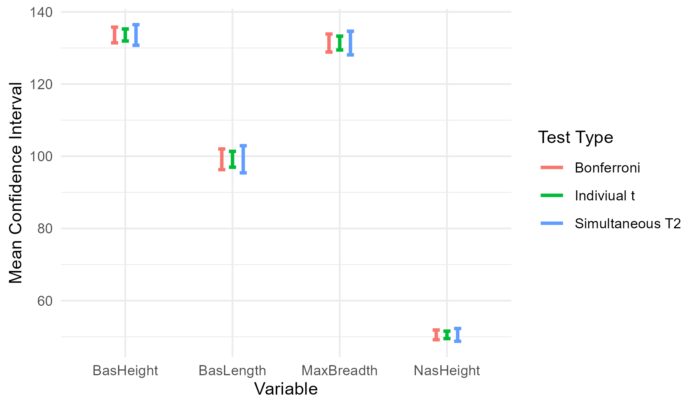

---
format:
  pdf:
    pdf-engine: pdflatex
    include-in-header:
      text: |
        \usepackage{amsmath}
        \usepackage{amssymb}
        \usepackage{graphicx}
        \usepackage{caption}
        \captionsetup[figure]{font=small}
        \usepackage{hyperref}

editor: visual
execute: 
  warning: false
  message: false
  echo: false
---

```{=latex}
\vspace*{-1cm}  % negative space to move title up
\begin{center}
    {\LARGE \textbf{Multivariate Analysis: CA Week Five}}\\[0.5cm]
    {\large Lwandile Duma and Isabella Lethbridge}\\[0.3cm]
    {\large 22 March 2026}
\end{center}
\vspace{0.15cm}
\noindent\rule{\linewidth}{0.5pt}
\vspace{0.3cm}
```
## Question 1

We are constructing confidence intervals for: <br>

Individual t: $$
\bar{x_i} \pm t_{n-1}(\alpha/2) \sqrt{\frac{s_{ii}}{n}}
$$ Simultaneaous t: $$
\bar{x_i}\pm \sqrt{\frac{p(n-1)}{(n-p)}
F_{p, {n-p}}(\alpha)}  \sqrt{\frac{s_{ii}}{n}} 
$$

Bonferroni: $$
\bar{x_{i}} \pm t_{n-1} (\frac{\alpha}{2p}) \sqrt{\frac{s_{ii}}{n}}
$$

```{r}
library(readr)
library(tidyverse)
library(knitr)

rm(list = ls())
CA1 <- read.csv2("CA1.csv", header = T, sep =",")

Q1 <- CA1 |>
  filter(TimePeriod == 1) |>
  select(-TimePeriod)
  
Q1mean <- Q1 |>
  summarise(
    MB = mean(MaxBreadth),
    BH = mean(BasHeight),
    BL = mean(BasLength),
    NH = mean(NasHeight)
  )

#Individual t
n <- nrow(Q1)
p <- ncol(Q1mean) 
alpha <- 0.05
tstat <- qt((1 - alpha/2), n - 1)
fstat <- qf(1 - alpha, p, n-p)
S <- cov(Q1)

varnames <- colnames(Q1mean)

lower1 <- numeric(4)
upper1 <- numeric(4)

for (i in 1:4){
  lower1[i] <- Q1mean[,i] - tstat*sqrt(S[i,i]/n)
  upper1[i] <- Q1mean[,i] + tstat*sqrt(S[i,i]/n)
}
IT_CI <- cbind(lower = lower1,upper = upper1)
rownames(IT_CI) <- varnames
#extraction
MB_Individual_t <- IT_CI["MB",]
BH_Individual_t <- IT_CI["BH",]
BL_Individual_t <- IT_CI["BL",]
NH_Individual_t <- IT_CI["NH",]


#Simultaneous T^2

margin <- sqrt((p*(n-1)/(n-p))*fstat)

lower2 <- numeric(4)
upper2 <- numeric(4)

for (i in 1:4){
  lower2[i] <- Q1mean[,i] - margin*sqrt(S[i,i]/n)
  upper2[i] <- Q1mean[,i] + margin*sqrt(S[i,i]/n)
}

#extraction
names(lower2) <- varnames
names(upper2) <- varnames


ST_CI <- cbind(lower = lower2, upper = upper2)
rownames(ST_CI) <- varnames

MB_Simultaneous_T2 <- ST_CI["MB", ]
BH_Simultaneous_T2 <- ST_CI["BH",]
BL_Simultaneous_T2 <- ST_CI["BL",]
NH_Simultaneous_T2 <- ST_CI["NH",]


#95% Bonferroni 
margin3 <- qt(1 - (alpha/(2*p)), n - 1)

lower3 <- numeric(4)
upper3 <- numeric(4)

for (i in 1:4){
  lower3[i] <- Q1mean[,i] - margin3*sqrt(S[i,i]/n)
  upper3[i] <- Q1mean[,i] + margin3*sqrt(S[i,i]/n)
}
names(lower3) <- varnames
names(upper3) <- varnames

BT_CI <- cbind(lower = lower3, upper = upper3)
rownames(BT_CI) <- varnames

MB_Bonferroni <- BT_CI["MB", ]
BH_Bonferroni <- BT_CI["BH",]
BL_Bonferroni <- BT_CI["BL",]
NH_Bonferroni <- BT_CI["NH",]


```

```{r}
library(dplyr)
library(knitr)
#now we do the tables 

#maxbreadth
c.i_MB <- rbind(MB_Individual_t, MB_Simultaneous_T2, MB_Bonferroni)
row.names(c.i_MB) <- c("Individual t", "Simultaneous $T^2$", "Bonferroni")
kable(c.i_MB,
caption = paste0("Confidence intervals for ", colnames(CA1)[1]),
col.names = c("Lower Bound","Upper Bound"),
align = c("c","c"))


#BasHeight
c.i_MB <- rbind(BH_Individual_t, BH_Simultaneous_T2, BH_Bonferroni)
row.names(c.i_MB) <- c("Individual t", "Simultaneous $T^2$", "Bonferroni")
kable(c.i_MB,
caption = paste0("Confidence intervals for ", colnames(CA1)[2]),
col.names = c("Lower Bound","Upper Bound"),
align = c("c","c"))


#BasLength
c.i_MB <- rbind(BL_Individual_t, BL_Simultaneous_T2, BL_Bonferroni)
row.names(c.i_MB) <- c("Individual t", "Simultaneous $T^2$", "Bonferroni")
kable(c.i_MB,
caption = paste0("Confidence intervals for ", colnames(CA1)[i]),
col.names = c("Lower Bound","Upper Bound"),
align = c("c","c"))


#Nasheight
c.i_MB <- rbind(NH_Individual_t, NH_Simultaneous_T2, NH_Bonferroni)
row.names(c.i_MB) <- c("Individual t", "Simultaneous $T^2$", "Bonferroni")
kable(c.i_MB,
caption = paste0("Confidence intervals for ", colnames(CA1)[i]),
col.names = c("Lower Bound","Upper Bound"),
align = c("c","c"))


library(ggplot2)
individualLower <- c(MB_Individual_t[1],BH_Individual_t[1],BL_Individual_t[1],
NH_Individual_t[1])

simultaneousLower <- c(MB_Simultaneous_T2[1], BH_Simultaneous_T2[1],
BL_Simultaneous_T2[1], NH_Simultaneous_T2[1])

bonferroniLower <- c(MB_Bonferroni[1], BH_Bonferroni[1], BL_Bonferroni[1],
NH_Bonferroni[1])

individualUpper <- c(MB_Individual_t[2],BH_Individual_t[2],BL_Individual_t[2],
NH_Individual_t[2])

simultaneousUpper <- c(MB_Simultaneous_T2[2], BH_Simultaneous_T2[2],
BL_Simultaneous_T2[2], NH_Simultaneous_T2[2])

bonferroniUpper <- c(MB_Bonferroni[2], BH_Bonferroni[2], BL_Bonferroni[2],
NH_Bonferroni[2])


dat <- data.frame(
method = c("MaxBreadth", "BasHeight", "BasLength", "NasHeight"),
lower = c(individualLower, simultaneousLower, bonferroniLower),
upper = c(individualUpper, simultaneousUpper, bonferroniUpper)
)

dat$group <- rep(c( "Indiviual t", "Simultaneous T2", "Bonferroni"),
each = nrow(dat) / 3)

Q1_plot <- ggplot(dat, aes(x = method)) +
geom_errorbar(aes(ymin = lower, ymax = upper, color = group), width = 0.2,
size =1, position = position_dodge(width = 0.3)) + # Set colors for the groups
labs(x = "Variable", y = "Mean Confidence Interval", color = "Test Type") +
theme_minimal()

# Save plot 
# ggsave("Q1_plot.png", Q1_plot, width = 6, height = 3.5)
# rm(list = ls())
```

@fig-Q1_plot compares the Individual t, Simultaneous $T^2$ and Bonferroni confidence intervals for the means in period 1. As expected the Individual t interval is the most narrow and the Simultaneous $T^2$ is the widest. The Bonferroni interval lies in between the other two. *BasLength* has the largest confidence intervals. This indicates that *BasLegth* is the most variable factor in the population in time period 1. The narrowest confidence interval corresponds to *NasHeight* which provides evidence that *NasHeight* is the least variable factor in time period 1.

::: {#fig-Q1_plot}
{width="0.7\\linewidth"}

Comparison of Individual t, Simultaneous $T^2$ and Bonferroni confidence intervals for the means in period 1.
:::

```{=tex}
\newpage  
\newpage
```
# Question 2

We are testing for $$
H_o: \mu_{initial} = \mu_1 = \mu_2 =... = \mu_4 \hspace{0.5cm} vs \hspace{0.5cm} H_1: \text{At least one $\mu_j$ differs}
$$ which is equivalent to: $$
H_o: \mu_{initial} - \mu_1 = ...= \mu_3 - \mu_4 \hspace{0.5cm} vs \hspace{0.5cm} H_1: \text{At least one $\mu_j$ differs}
$$

And we define our contrast matrix $$
C = 
\begin{pmatrix}
1 & -1 & 0 & 0 & 0\\
0 & 1 & -1 &0 & 0\\
0 & 0&1 & -1 & 0 \\
0& 0 & 0 & 1 & -1
\end{pmatrix}
$$ Thus, the hypotheses are now, $$H_o : C\mu = 0 \hspace{0.5cm} vs \hspace{0.5cm} H_1: C\mu \neq 0 \hspace{0.5cm}$$

Where,

$$
C\mu = 
\begin{pmatrix}
\mu_{initial} - \mu_1\\
\mu_1 - \mu_2\\
\mu_2 - \mu_3 \\
\mu_3 - \mu_4
\end{pmatrix}
$$

```{r}
library(readxl)
library(tidyverse)
library(knitr)
data <- read.table("CA5.txt", header = T, sep = ",")

#we can look at the decreases between each variable. 
#we construct the contrast matrix which has q dimensions


n <- nrow(data)
q <- ncol(data)
alpha <- 0.05


#get mean weights
Xm <- colMeans(data)
S <- cov(data)


C <- matrix(c(
  1, -1, 0,0,0,
  0,1,-1,0,0,
  0,0,1,-1,0,
  0,0,0, 1,-1
  ), nrow= 4, ncol = 5, byrow = TRUE)


#we construct new Hotelling T^2 statistic
T_2hotelling <- n*t(C%*%Xm)%*%solve(C%*%S%*%t(C))%*%(C%*%Xm)

T2 <- as.numeric(T_2hotelling)
Fstat <- T_2hotelling*((n-q+1)/((n-1)*(q-1)))


#lets find p-value


p_val <- 1-pf(Fstat, q-1, n-q+1)
p_val <- round(p_val , 3)


Fcrit <- qf(1-alpha, q-1, n-q+1)
critic_value <- ((n-1)*(q-1)/(n-q+1) * Fcrit)

S1 <- matrix(diag(C%*%S%*%t(C))/n, 4)

CI_l <- round( C%*%Xm - sqrt(critic_value)*S1, 3)
CI_U <- round( C%*%Xm + sqrt(critic_value)*S1, 3)

Ci_w <- cbind(CI_l, CI_U)
```

\newpage

The p-value is `r p_val`. \newline The very small p-value provides strong evidence that at least one time points average weight differs. The confidence intervals in @tbl-Q2 do not include 0. This suggests that there is a significant difference between time point average weights. The difference between the initial timepoint and timepoint 1, as well as the difference between timepoint 1 and timepoint 2 is positive, suggesting an increase in weight over this period. However, from timepoint 2 to 3 and from 3 to 4 the difference is negative, suggesting a decrease in weight. \newline The decreases in weight are of larger magnitude than the initial increase, providing evidence that after the 4 weeks the individuals has lost weight and the diet was effective.

Therefore, the resulting simultaneous $T^2$ confidence interval is seen in @tbl-Q2.

```{r}
#| label: tbl-Q2
#| tbl-cap: "Confidence intervals for repeated measures"

kable(Ci_w,
col.names = c("Lower Bound","Upper Bound"),
align = c("c","c"))
```
