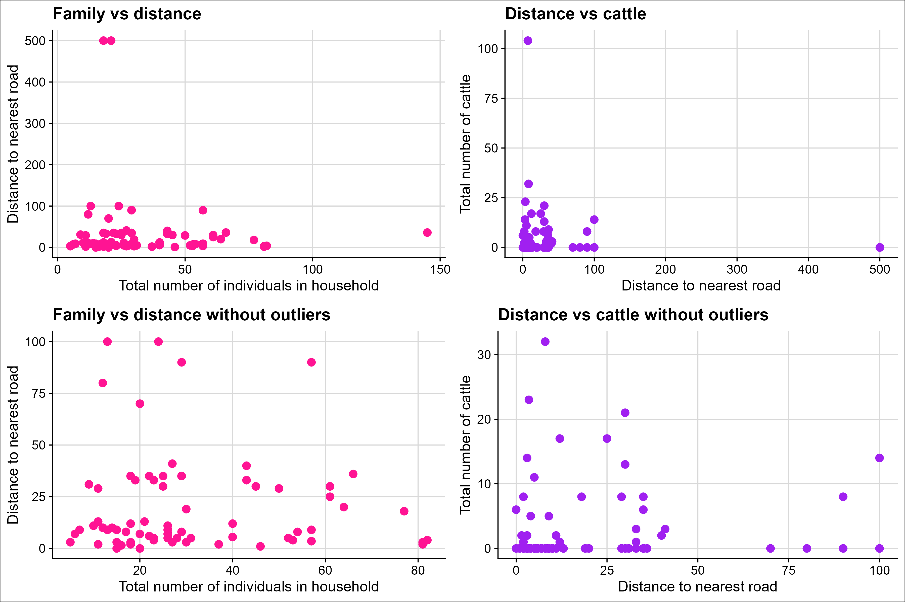

## Setup
```{r}
if (!requireNamespace("remotes", quietly = TRUE)) {
install.packages("remotes")
}
# be sure to install from `2024` branch (code below does this)
remotes::install_github("MiguelRodo/DataTidy23RodoHonsMult@2024")
data("data_tidy_mali", package = "DataTidy23RodoHonsMult")

library(tidyverse)
library(readr)
library(ggplot2)
library(cowplot)
library(knitr)
library(ggcorrplot)
library(qqplotr)
```

## Question 1
```{r}
# Scatterplots
p1 <- ggplot(data = data_tidy_mali,
             mapping = aes(x = family, y = dist_rd)) +
  geom_point(colour = "deeppink", size = 3) +
  labs(
    title = "Family vs distance",
    x = "Total number of individuals in household",
    y = "Distance to nearest road"
  ) +
  theme_cowplot() +
  background_grid(major = 'xy')

p2 <- ggplot(data = data_tidy_mali,
             mapping = aes(x = dist_rd, y = cattle)) +
  geom_point(colour = "purple", size = 3) +
  labs(
    title = "Distance vs cattle",
    x = "Distance to nearest road",
    y = "Total number of cattle"
  ) +
  theme_cowplot() +
  background_grid(major = 'xy')

# Remove outliers 
new_dat <- data_tidy_mali |>
  filter(family < 100) |>
  filter(dist_rd < 200) |>
  filter(cattle < 40)

p3 <- ggplot(data = new_dat,
             mapping = aes(x = family, y = dist_rd)) +
  geom_point(colour = "deeppink", size = 3) +
  labs(
    title = "Family vs distance without outliers",
    x = "Total number of individuals in household",
    y = "Distance to nearest road"
  ) +
  theme_cowplot() +
  background_grid(major = 'xy')

p4 <- ggplot(data = new_dat,
             mapping = aes(x = dist_rd, y = cattle)) +
  geom_point(colour = "purple", size = 3) +
  labs(
    title = "Distance vs cattle without outliers",
    x = "Distance to nearest road",
    y = "Total number of cattle"
  ) +
  theme_cowplot() +
  background_grid(major = 'xy')


#Combine plots
combined_plot <- plot_grid(p1, p2, p3, p4, ncol = 2)
combined_plot <- combined_plot +
  theme(
    plot.background = element_rect(fill = "white"),
    panel.background = element_rect(fill = "white")
  )

ggsave("_figure/scatterplot.png", plot = combined_plot, height = 8, width = 12)
```

::: {#fig-scatterplot}


Scatterplots of family, distance and cattle variables before and after outliers are removed. 
:::


## Question 2
Since the variables are measured in different units we standardise the variables. 
```{r}
scaled_newdat <- scale(new_dat)
```

## Question 3
```{r}
# covariance mat
cov_mat <- cor(new_dat)

# Apply eigen decomposition
eig_obj <- eigen(cov_mat)

eig_vec_mat <- eig_obj$vectors
rownames(eig_vec_mat) <- paste0("V", 1:9)
colnames(eig_vec_mat) <- paste0("PC", 1:9)

PCS <- eig_obj$values

# Scree plot
tot <- sum(PCS)
props <- numeric(9)
for (i in 1:9){
  props[i] <- PCS[i]/tot
}

Indx <- seq(1,9,1)

output <- cbind(props, Indx)

ggplot(data = output, mapping = aes(x = Indx, y = props)) +
  geom_point()+
  scale_x_continuous(breaks = unique(Indx)) +
  geom_line() +
  labs(
    title = "Scree plot",
    x = "PCA Index",
    y = "Proportion of Variance"
  ) +
  theme_cowplot() +
```

## Question 4
```{r}
dat_mat <- as.matrix(scaled_newdat)
svd_dat <- svd(dat_mat)
svd_dat$d^2 |> signif(3)


(dat_mat %*% svd_dat$v) |>
  head() |>
  signif(3)

svd_dat$v |>
  signif(3)
```

## Question 5
```{r}

```

## Question 6
```{r}
# Compute the correlation matrix between original variables and principal components
P <- eig_obj$vectors
D <- diag(eig_obj$values)
var_mat <- diag(diag(cov_mat))
numerator <- P %*% sqrt(D)
corr_mat <- var_mat %*% numerator
rownames(corr_mat) <- paste0("V", 1:9)
colnames(corr_mat) <- paste0("PC", 1:9)

col1 <- as.data.frame(corr_mat[,1])
colnames(col1) <- c("PC1")
col1 |> signif(2) |> knitr::kable()
```

## Question 7
```{r}

```